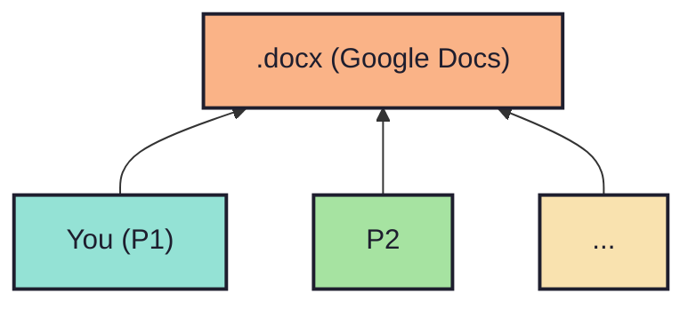

## Scenario 2

<!-- new_lines: 2 -->

<!-- pause -->
<!-- new_lines: 3 -->
<!-- incremental_lists: true -->

- `Q>` Ever worked together on a shared document?
- VC also happens `behind the scenes` here.
- `Real-time collaboration` is tedious to implement.

<!-- incremental_lists: false -->
