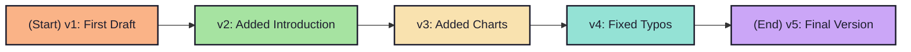
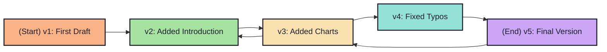
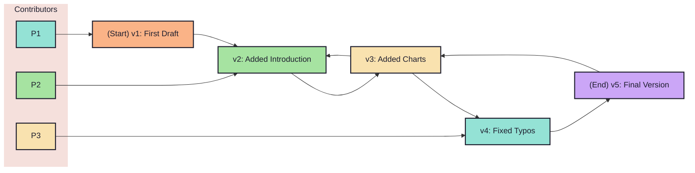

# 1.1. So, what is Version Control?

<!-- pause -->
<!-- new_line -->

- `Version Control (VC, VCS)` is a system that `records changes` to `a file` or
  `set
  of files` over time, so you can `recall specific versions` later.

<!-- pause -->
<!-- new_line -->

<!-- pause -->
<!-- new_line -->

Now, at `any point` you can:

<!-- pause -->
<!-- new_line -->

What if there are `multiple people` in the mix?

<!-- new_line -->

<!-- new_line -->

- `->` A VCS helps you make sense of this `chaos` and `sync everyone's changes`
  without having to do things `manually`.
