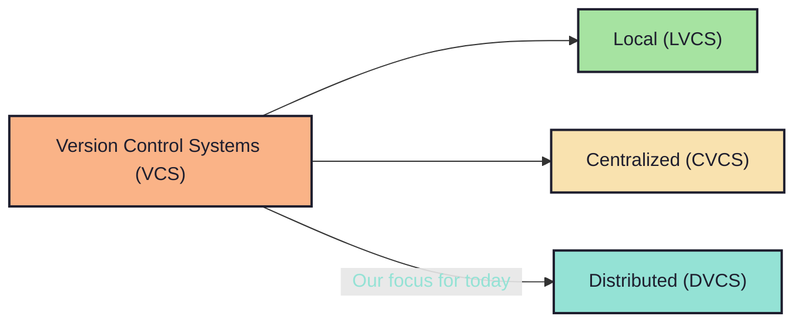

# 1.2. What about the types? Lets have a ~~broad~~ narrow look:

<!-- pause -->
<!-- new_line -->

## Generation.

<!-- new_lines: 3 -->

<!-- new_lines: 3 -->
<!-- incremental_lists: true -->

- `->` As the internet evolved, collaboration became more `distributed` than
  ever.
- `->` Use-case for `centralized` VCS still exist; specially for large
  `in-house` projects.
  - e.g. Games like `Fortnite`, `Borderlands`,
    ~~Assassin's Creed (cause nobody likes Ubisoft
    :P)~~

<!-- incremental_lists: false -->
