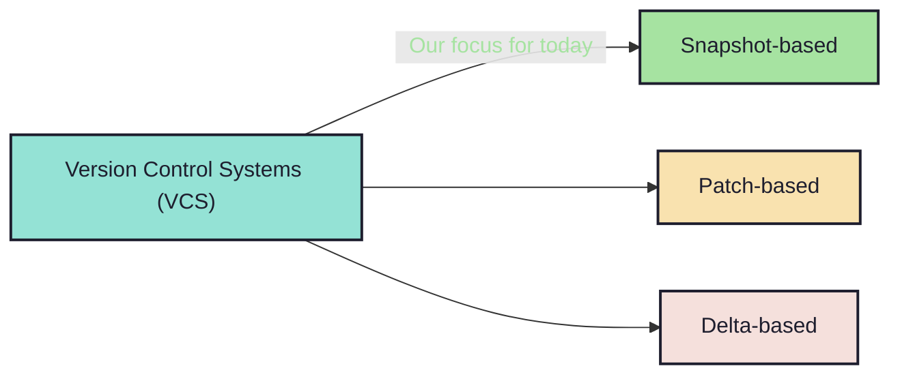

# 1.2. What about the types? Lets have a ~~broad~~ narrow look:

<!-- new_line -->

## Architecture.

<!-- new_lines: 3 -->

<!-- incremental_lists: true -->
<!-- new_lines: 3 -->

- `-> Snapshot-based` systems are generally the `fastest` and the
  `most popular`.
- `-> Patch-based` system are generally easier to user and
  `mathematically sound`.

<!-- incremental_lists: false -->
