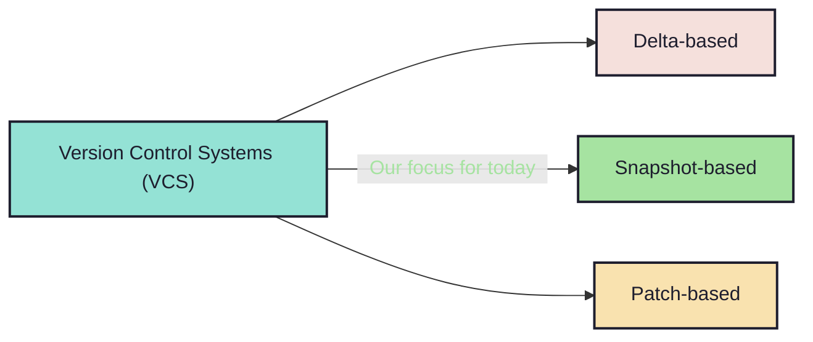

# 1.2. What about the types? Lets have a ~~broad~~ narrow look:

<!-- new_line -->

## Architecture.

<!-- new_lines: 3 -->

<!-- new_lines: 3 -->
<!-- pause -->

`-> Snapshot-based` systems are generally the `fastest` and the `most popular`.

<!-- pause -->

`-> Patch-based` system are generally easier to use and `mathematically sound`.

<!-- pause -->

`->` `Patch-based` systems can also be seen as an improved take on `delta-based`
systems.
