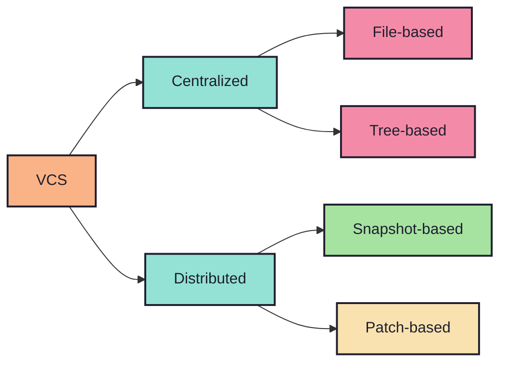

# 1.2. What about the types? Lets have a ~~broad~~ narrow look:

<!-- new_lines: 2 -->

```mermaid +render
flowchart LR
  VCS --> Centralized
  VCS --> Distributed
  Distributed --> SNAPSHOT["Snapshot-based"]
  Distributed --> PATCH["Patch-based"]
  Centralized --> FILE["File-based"]
  Centralized --> TREE["Tree-based"]

  style VCS fill:#fab387,stroke:#1e1e2e,stroke-width:2px,color:#1e1e2e
  style Centralized fill:#94e2d5,stroke:#1e1e2e,stroke-width:2px,color:#1e1e2e
  style Distributed fill:#94e2d5,stroke:#1e1e2e,stroke-width:2px,color:#1e1e2e

  style SNAPSHOT fill:#a6e3a1,stroke:#1e1e2e,stroke-width:2px,color:#1e1e2e
  style PATCH fill:#f9e2af,stroke:#1e1e2e,stroke-width:2px,color:#1e1e2e
  style FILE fill:#f38ba8,stroke:#1e1e2e,stroke-width:2px,color:#1e1e2e
  style TREE fill:#f38ba8,stroke:#1e1e2e,stroke-width:2px,color:#1e1e2e
```
