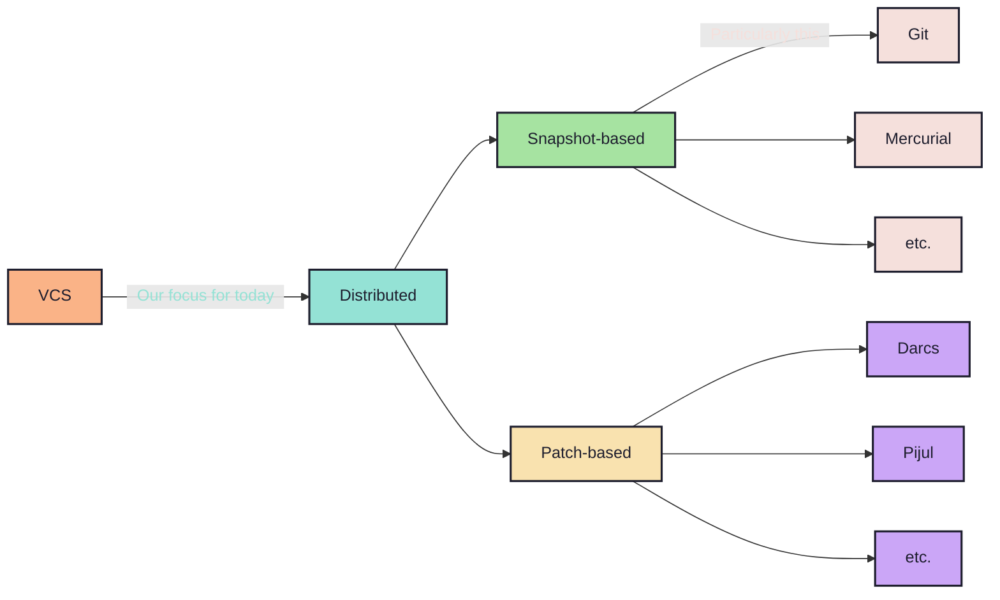

# 1.4. Today's agenda

<!-- new_lines: 2 -->

```mermaid +render
flowchart LR
  VCS --> |<span style="padding:10px;color:#94e2d5;">Our focus for today</span>| Distributed
  Distributed --> SNAPSHOT["Snapshot-based"]
  Distributed --> PATCH["Patch-based"]

  SNAPSHOT --> |<span style="padding:10px;color:#f5e0dc;">Particularly this</span>| Git
  SNAPSHOT --> Mercurial
  SNAPSHOT --> ETC1["etc."]

  PATCH --> Darcs
  PATCH --> Pijul
  PATCH --> ETC2["etc."]

  style VCS fill:#fab387,stroke:#1e1e2e,stroke-width:2px,color:#1e1e2e
  style Distributed fill:#94e2d5,stroke:#1e1e2e,stroke-width:2px,color:#1e1e2e

  style SNAPSHOT fill:#a6e3a1,stroke:#1e1e2e,stroke-width:2px,color:#1e1e2e
  style Git fill:#f5e0dc,stroke:#1e1e2e,stroke-width:2px,color:#1e1e2e
  style Mercurial fill:#f5e0dc,stroke:#1e1e2e,stroke-width:2px,color:#1e1e2e
  style ETC1 fill:#f5e0dc,stroke:#1e1e2e,stroke-width:2px,color:#1e1e2e

  style PATCH fill:#f9e2af,stroke:#1e1e2e,stroke-width:2px,color:#1e1e2e
  style Darcs fill:#cba6f7,stroke:#1e1e2e,stroke-width:2px,color:#1e1e2e
  style Pijul fill:#cba6f7,stroke:#1e1e2e,stroke-width:2px,color:#1e1e2e
  style ETC2 fill:#cba6f7,stroke:#1e1e2e,stroke-width:2px,color:#1e1e2e
```

<!-- pause -->
