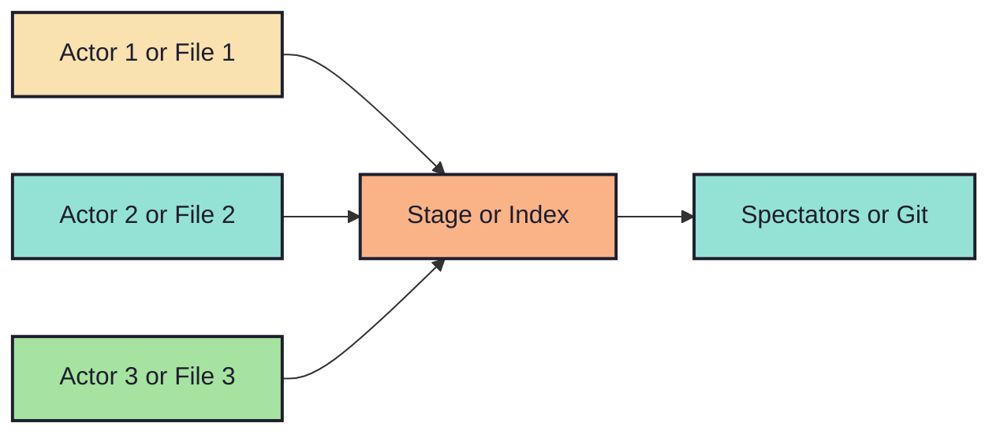

# 1.9. What even is this staging area/index?

<!-- pause -->
<!-- new_line -->

Here is a pictorial analogy for you:

<!-- new_line -->

<!-- pause -->
<!-- new_line -->

So, what is the `observation`?

<!-- new_line -->
<!-- incremental_lists: true -->

- `Spectators` or `Git` only pay attention to what is currently on the `stage`.
- `Actors` or `files` need to enter the stage before `spectators` or `Git` can
  observe them.

<!-- new_line -->
<!-- incremental_lists: false -->

`->` Therefore, `Spectators` or `Git` stop observing `actors` or `files` that
leave the stage.

<!-- pause -->

`->` Life isn't very intuitive at times as `snapshots` do change the logic being
applied here.

<!-- pause -->

`->` No worries as we'll cover the cases soon.
