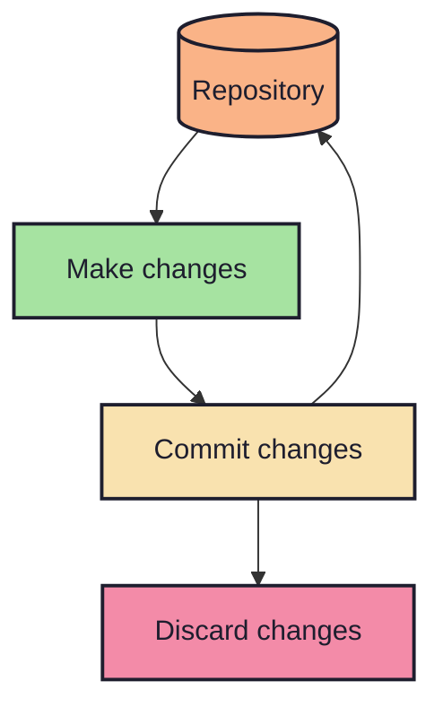
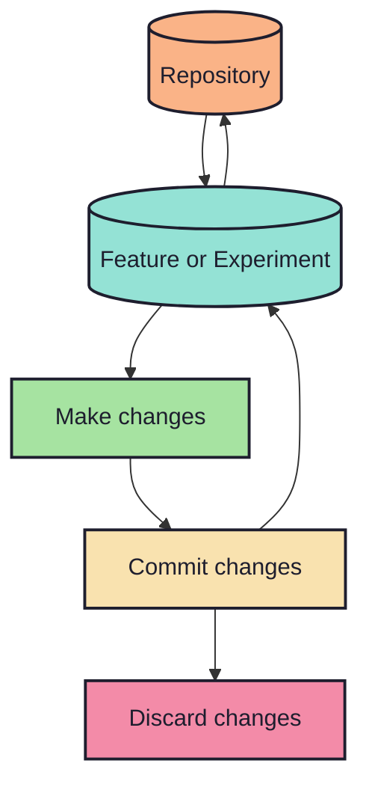
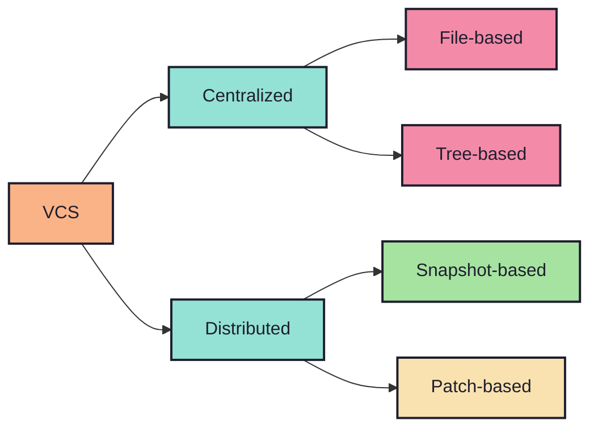
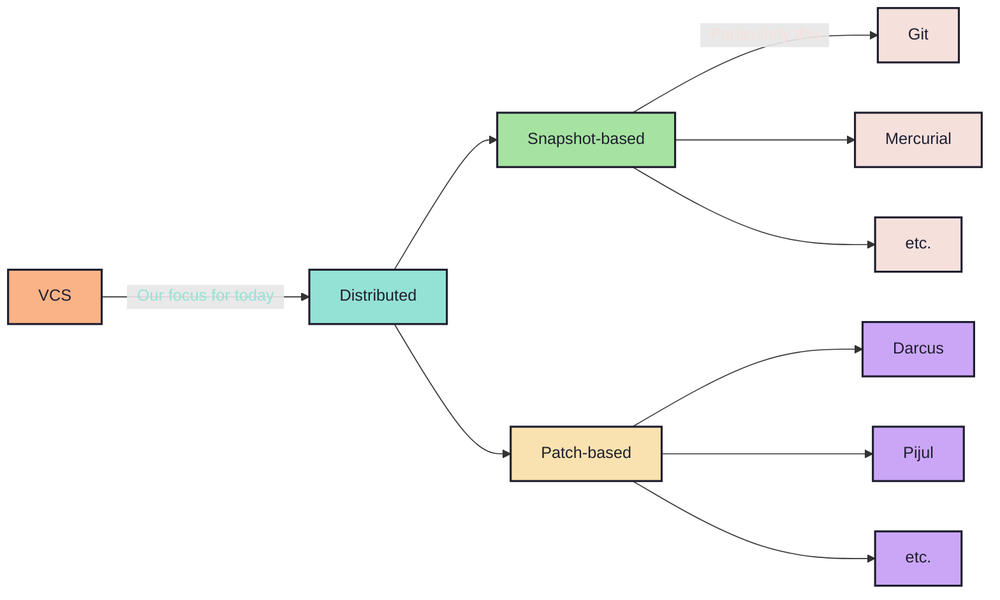

# What does one mean by Version Control?

- Version control is like keeping a `journal of your files`.
- It tracks `changes over time`, so you can `go back if something breaks`.
- `Multiple people` can work together safely `without overwriting each other`.
- You can `try new ideas` and `merge them back` when ready, without
  `conflicting
  others`.

<!-- new_line -->
<!-- column_layout: [1, 1] -->
<!-- column: 0 -->

<!-- column: 1 -->

<!-- reset_layout -->
<!-- alignment: center -->

e.g. general workflow of a snapshot based VCS

<!-- end_slide -->

# A narrow look at the types of VCS

<!-- end_slide -->
<!-- column_layout: [7, 3] -->
<!-- column: 0 -->

# Today's agenda

<!-- new_lines: 2 -->

<!-- pause -->
<!-- column: 1 -->
<!-- new_lines: 5 -->

## Overview

<!-- pause -->

Git has:

<!-- incremental_lists: true -->

- 82 `porcelain` cmds
  - `main`
  - `manipulators`
  - `interrogators`
  - `interactors`

<!-- new_line -->

- 63 `plumbing` cmds
  - `manipulators`
  - `interrogators`
  - `syncing`
  - `internal`

<!-- incremental_lists: false -->
<!-- new_line -->

# Total: 145
