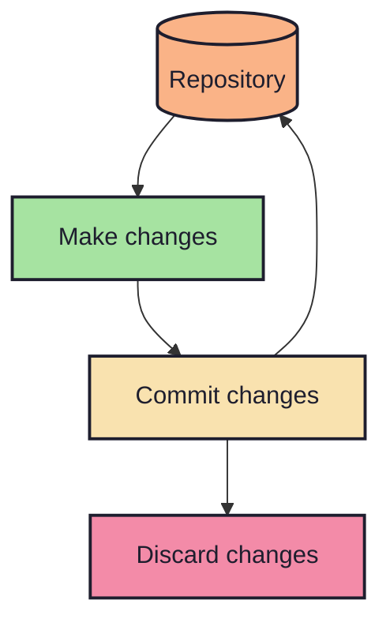
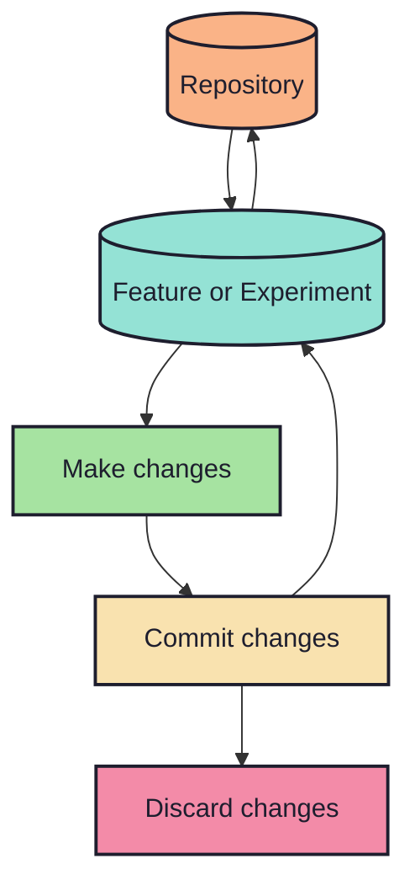
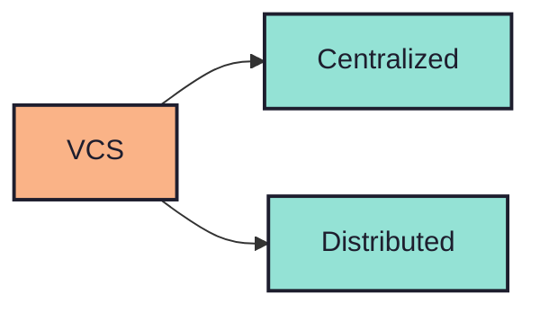
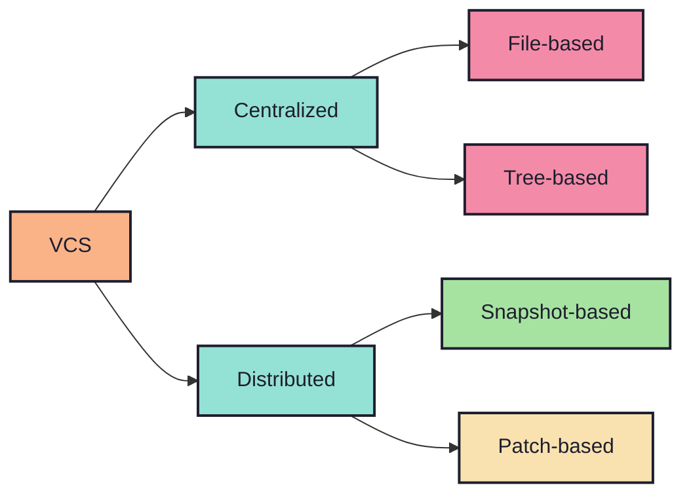
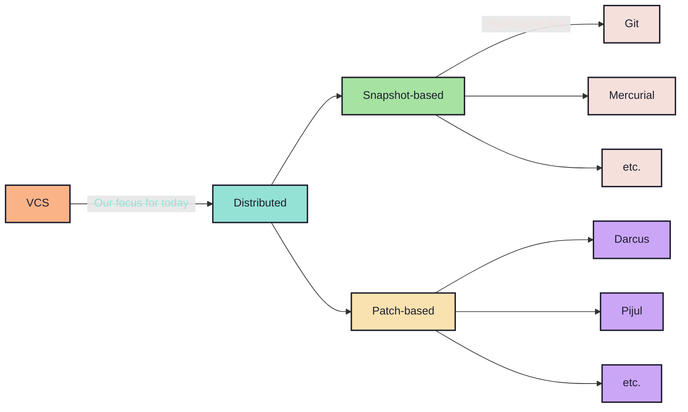

# 1.1. What does one mean by Version Control?

- Version control is like keeping a `journal of your files`.
- It tracks `changes over time`, so you can `go back if something breaks`.
- `Multiple people` can work together safely `without overwriting each other`.
- You can `try new ideas` and `merge them back` when ready, without
  `conflicting
  others`.

<!-- new_line -->
<!-- column_layout: [1, 1] -->
<!-- column: 0 -->



<!-- column: 1 -->



<!-- reset_layout -->
<!-- alignment: center -->

e.g. general workflow of a snapshot based VCS

<!-- end_slide -->

# 1.2. What about the types? Lets have a broad look:

<!-- end_slide -->

# 1.2. What about the types? Lets have a ~~broad~~ <span style="color:green;">narrow</span> look:

<!-- pause -->



<!-- end_slide -->

# 1.2. What about the types? Lets have a ~~broad~~ <span style="color:green;">narrow</span> look:



<!-- end_slide -->

# 1.3. Okay, what's the difference?

<!-- pause -->

Well, take a look at this `pretty table` for a change (literally):

```typst +render
#import "@preview/catppuccin:1.0.0": catppuccin, flavors
#show: catppuccin.with(flavors.mocha)
#set text(font: "Maple Mono NF")

#set table(
  stroke: none,
  gutter: 0.3em,
  fill: (x, y) =>
    if x == 0 or y == 0 { rgb(flavors.mocha.colors.lavender.hex) },
  inset: (right: 1.5em),
)

#show table.cell: it => {
  if it.x == 0 or it.y == 0 {
    set text(rgb(flavors.mocha.colors.base.hex))
    strong(it)
  } else {
    it
  }
}

#table(
  columns: 4,
  [], [Snapshot-based], [Patch-based], [File-based / Tree-based],

  [Initial balance],
  [100],
  text(rgb(flavors.mocha.colors.green.hex))[+100],
  text(rgb(flavors.mocha.colors.green.hex))[+100],

  [Salary],
  [400],
  text(rgb(flavors.mocha.colors.green.hex))[+300],
  text(rgb(flavors.mocha.colors.red.hex))[-100] + ", " + text(rgb(flavors.mocha.colors.green.hex))[+400],

  [Heating],
  [0],
  text(rgb(flavors.mocha.colors.red.hex))[-400],
  text(rgb(flavors.mocha.colors.red.hex))[-400] + ", " + text(rgb(flavors.mocha.colors.green.hex))[+0],
)
```

<!-- pause -->

What is the `observation`?

<!-- incremental_lists: true -->

- `Snapshot-based` VCS store the `state` of the changes.
- `Patch-based` VCS store the `patches applied` or `operations` made by changes.
- `File-based` or `Tree-based` VCS store the `deltas` or `differences` made by
  changes.
  - `File-based` VCS tracks changes at the level of `individual files`.
  - `Tree-based` VCS tracks changes at the level of an entire directory tree,
    not just individual files.

<!-- incremental_lists: false -->

<!-- new_lines: 2 -->
<!-- alignment: center -->

~~<span style="color:red;">Btw, on the note of patch-based systems, the
mathematics behind the theory of patches uses CRDTs...</span>~~

Ok, lets not!

<!-- pause -->

Drop a message to `@debarchito`, if you want to discuss the nerdy stuffs!

<!-- end_slide -->
<!-- column_layout: [7, 3] -->
<!-- column: 0 -->

# Today's agenda

<!-- new_lines: 2 -->



<!-- pause -->
<!-- column: 1 -->
<!-- new_lines: 3 -->

## Overview

<!-- pause -->

Git has:

<!-- incremental_lists: true -->

- 82 `porcelain` commands
  - `main`
  - `manipulators`
  - `interrogators`
  - `interactors`

<!-- new_line -->

- 63 `plumbing` commands
  - `manipulators`
  - `interrogators`
  - `syncing`
  - `internal`

<!-- incremental_lists: false -->
<!-- new_line -->

`->` A total of `145 commands`! While that's a lot, _<span style="color:red;">we
won't need them all</span>_ through out this presentation.
